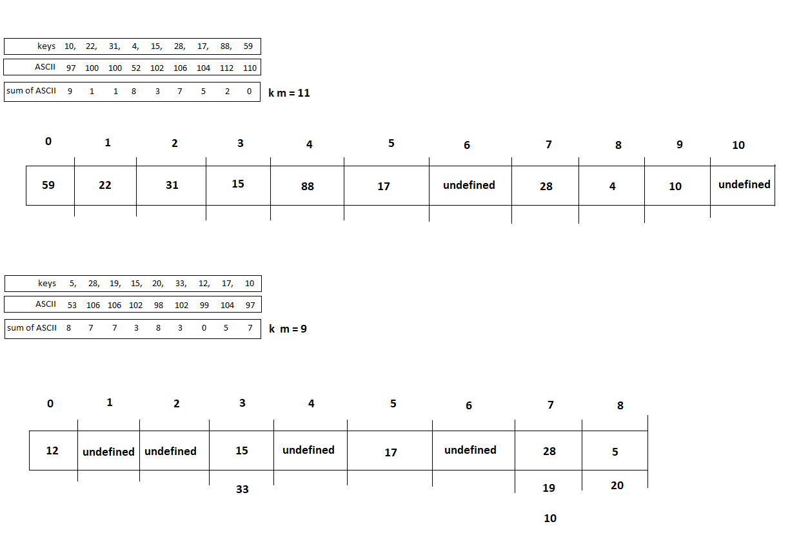

# DSA-Hashmaps

### WhatDoesThisDo:

it should overwrite the intial key/value pair. 
On Map1 you should see
Hello World: 20

On Map2 you should see
Hello World: 10

### Demonstrate understanding of Hash maps

